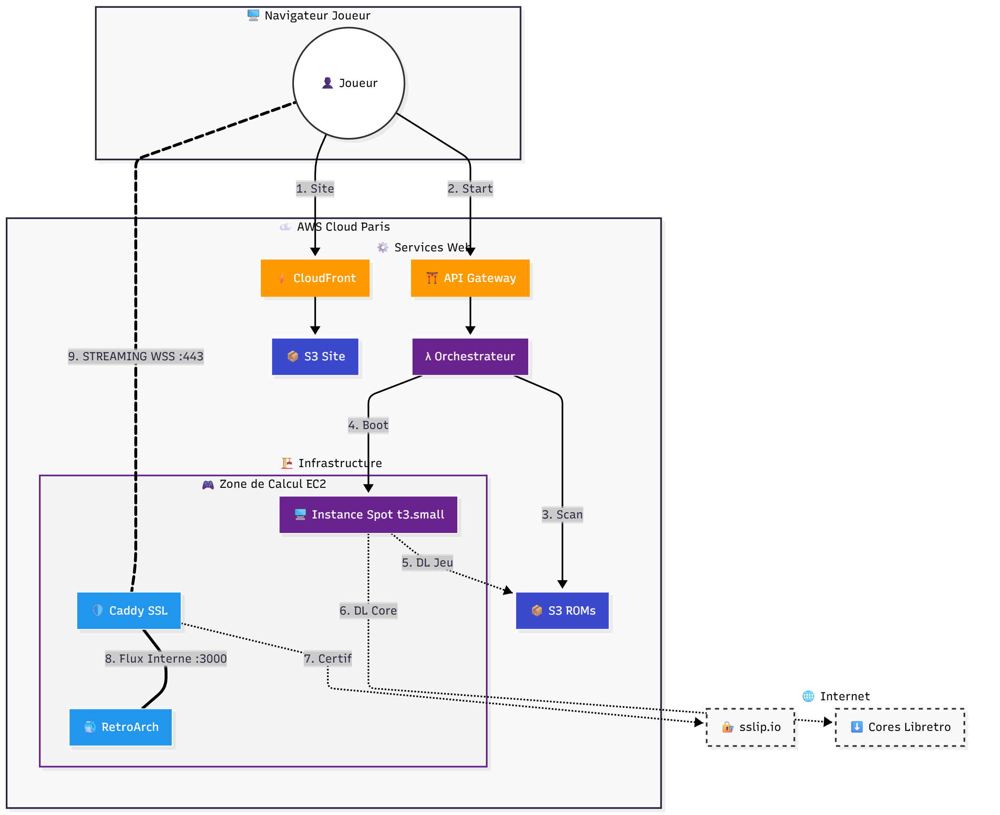

# 👾 RetroCloud - AWS Cloud Gaming Platform

**RetroCloud** est une plateforme de *Cloud Gaming* open-source permettant de jouer à des jeux rétro (NES, SNES, GameBoy, MegaDrive, PS1...) directement depuis un navigateur web, sans installation locale.

Le projet démontre une architecture **Event-Driven** et **Serverless** sur AWS, optimisée pour la performance (latence faible) et le coût (instances Spot).



---

## 🏗️ Architecture Technique Détaillée

Ce projet n'est pas un simple site web, c'est un orchestrateur de machines virtuelles à la demande. Voici comment chaque brique fonctionne :

### 1. Frontend (Distribution & UI)
* **AWS S3 (Website Hosting)** : Héberge le code source du lobby (HTML/JS/CSS).
* **Amazon CloudFront (CDN)** : Distribue le site mondialement avec une latence faible et sécurise l'accès via HTTPS. C'est le point d'entrée unique pour les utilisateurs.

### 2. Backend (Control Plane Serverless)
* **Amazon API Gateway** : Reçoit les requêtes REST du frontend (Lister les jeux, Lancer une instance).
* **AWS Lambda (Python)** : Le "cerveau" du système.
    * Elle scanne le bucket S3 pour lister les ROMs disponibles.
    * Elle demande à EC2 de lancer une nouvelle instance quand un joueur clique sur un jeu.
    * Elle gère la logique de **Retry Multi-AZ** : si la zone A est pleine, elle tente la B, puis la C.

### 3. Compute (Zone de Jeu)
* **Amazon EC2 (Instances Spot)** : Nous utilisons des instances `t3.small` (2 vCPU, 2 Go RAM).
    * **Pourquoi Spot ?** Pour réduire les couts de ~70% par rapport aux prix à la demande.
    * **Pourquoi EC2 et pas Fargate ?** Pour avoir un accès direct au réseau (`host networking`) indispensable pour le streaming UDP/WebRTC à faible latence, et pour la compatibilité future avec les GPU.
* **AMI Personnalisée (Golden Image)** : Une image machine pré-configurée avec Docker et les drivers nécessaires, permettant un démarrage en **< 45 secondes**.

### 4. Streaming & Logiciel (Sur l'instance)
* **Docker** : Isole l'environnement de jeu.
* **RetroArch** : Le moteur d'émulation multi-plateforme.
* **KasmVNC (Selkies)** : Technologie de streaming WebRTC open-source permettant d'afficher le flux vidéo et de capturer les inputs (manette/clavier) dans un navigateur moderne.
* **Caddy Server** : Un serveur web léger qui agit comme **Reverse Proxy**. Il convertit automatiquement l'IP de l'instance en un nom de domaine HTTPS (`.sslip.io`) et génère un certificat SSL à la volée pour garantir une connexion sécurisée (WSS).

### 5. Stockage
* **Amazon S3 (ROMs Bucket)** : Stockage objet durable pour les fichiers de jeux (`.nes`, `.sfc`, etc.). L'instance télécharge uniquement le jeu demandé au démarrage.

---

## 💰 Estimation des Coûts

Le projet est conçu pour être extrêmement économique (échelle personnelle).

| Service | Usage estimé | Coût Mensuel (Est.) |
| :--- | :--- | :--- |
| **S3 (Stockage)** | 50 Go de jeux | ~1,15 € |
| **EC2 (Spot)** | 10h de jeu / mois (t3.small) | ~0,06 € |
| **EBS (Disque)** | Disques éphémères (10h) | ~0,10 € |
| **Data Transfer** | 15 Go (Streaming vidéo) | ~1,35 € |
| **Lambda/API** | Free Tier | 0,00 € |
| **TOTAL** | **Pour 10h de jeu** | **~ 2,66 € / mois** |

*Note : L'instance est configurée pour s'éteindre automatiquement après 1h (Auto-kill switch) pour éviter toute facturation accidentelle.*

---

## 🛠️ Déploiement

### Pré-requis
* Compte AWS actif.
* AWS CLI configuré (`aws configure`).
* Node.js (pour CDK) et Python 3 installés.
* Une paire de clés SSH créée dans la région cible (ex: `kp-retro`).
* Une AMI de base créée avec Docker pré-installé.

### Installation

1.  **Cloner le dépôt :**
    ```bash
    git clone [https://github.com/TON_USER/RetroCloud.git](https://github.com/TON_USER/RetroCloud.git)
    cd RetroCloud
    ```

2.  **Installer les dépendances CDK :**
    ```bash
    pip install -r requirements.txt
    ```

3.  **Configurer les variables :**
    Modifiez `lambda_backend/index.py` pour y mettre votre `AMI_ID` et votre `SSH_KEY_NAME`.

4.  **Déployer l'infrastructure :**
    ```bash
    npx aws-cdk@latest deploy
    ```

5.  **Configurer le Frontend :**
    * Récupérez l'URL de l'API dans les outputs du terminal.
    * Mettez à jour la variable `API_URL` dans `website/index.html`.
    * Redéployez le site : `npx aws-cdk@latest deploy`.

---

## 🎮 Utilisation

1.  Ouvrez l'URL CloudFront fournie (`https://xxx.cloudfront.net`).
2.  Naviguez dans votre catalogue de jeux S3.
3.  Cliquez sur un jeu pour provisionner un serveur à la volée.
4.  Attendez que l'instance démarre (~1 min).
5.  Cliquez sur **"JOUER MAINTENANT"** pour ouvrir la session de streaming sécurisée.

---

**Auteur :** [Ton Nom/Pseudo]
*Projet réalisé avec AWS CDK (Infrastructure as Code).*